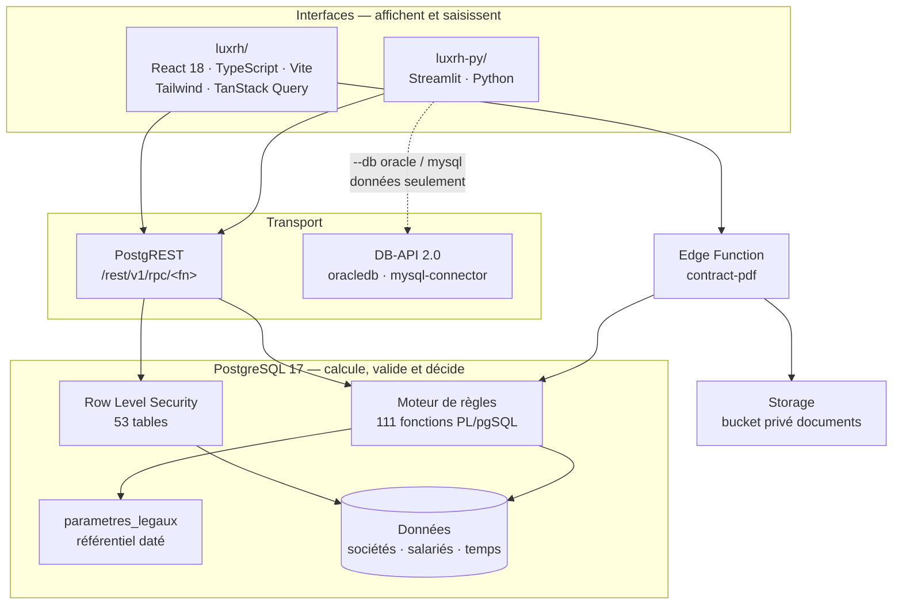
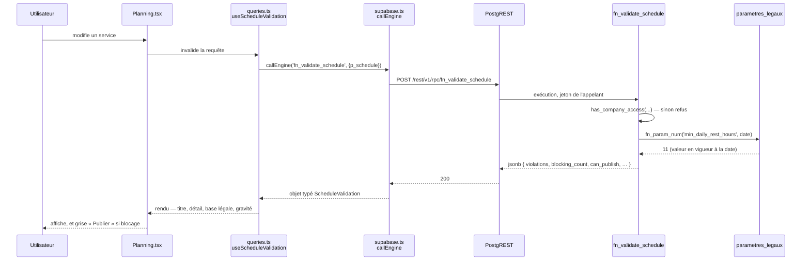

# Architecture

Ce document décrit l'architecture **réelle** du projet, telle qu'elle se lit dans le dépôt : les
deux fronts, le moteur PL/pgSQL, le référentiel daté, l'isolation en base, et le trajet complet
d'une requête. Il s'adresse aux développeurs, quel que soit le bout par lequel ils entrent.

---

## Vue d'ensemble



| Couche | Choix | Où |
|---|---|---|
| Front web | React 18, TypeScript, Vite 6, Tailwind 3, TanStack Query 5, React Router 6, react-hook-form + zod | `luxrh/src/` |
| Front Python | Streamlit, client `supabase` officiel | `luxrh-py/` |
| Transport | PostgREST (RPC et REST), via `@supabase/supabase-js` et `supabase-py` | — |
| Authentification | Supabase Auth, flux PKCE des deux côtés | `luxrh/src/lib/supabase.ts`, `luxrh-py/luxrh/client.py` |
| Autorisation | Row Level Security, par organisation, société et rôle | `luxrh/supabase/migrations/…_08_row_level_security.sql` et suivantes |
| Logique métier | Fonctions PL/pgSQL, jamais dans le client | `luxrh/supabase/migrations/` |
| Documents | Supabase Storage, bucket privé `documents` | migration 17 |
| PDF | Edge Function Deno `contract-pdf` | `luxrh/supabase/functions/contract-pdf/` |

---

## Pourquoi tout le métier vit en base

C'est le choix structurant du projet, et il découle de trois contraintes concrètes.

**Deux interfaces, une seule loi.** React et Streamlit ne partagent pas une ligne de code. S'ils
partageaient plutôt des règles écrites deux fois, elles divergeraient — et la divergence ne se
verrait qu'au moment où un contrat aurait déjà été signé sur la mauvaise valeur. En plaçant la
règle en base, une correction vaut immédiatement pour les deux, et pour tout client futur.

**Une règle évaluée côté client est fausse dès qu'un paramètre change.** Le navigateur porte la
version du code déployée le jour où il a chargé la page. Le référentiel, lui, se met à jour en
continu. Le seul endroit où les deux sont toujours en phase est le serveur qui lit le référentiel
au moment du calcul.

**L'isolation ne se délègue pas à l'interface.** Une requête directe sur l'API doit être aussi
cloisonnée qu'un clic dans l'écran. C'est ce que garantit RLS, et ce que `tests/rls.test.mjs`
vérifie en interrogeant l'API avec le jeton d'un autre espace de travail.

Corollaire : **aucun seuil, taux ou durée légale n'est écrit dans le code applicatif.** Le front
reçoit du moteur non seulement les chiffres, mais le **texte des messages** et les **références
d'articles**. `luxrh/src/lib/engine.ts` ne contient que des types — 424 lignes de formes de retour,
zéro règle.

---

## Où vivent les règles

Trois couches, trois responsabilités, qui ne se substituent jamais l'une à l'autre :

| Couche | Ce qui y vit | Ce qui n'y vit pas |
|---|---|---|
| Front (`luxrh/`, `luxrh-py/`) | Affichage, saisie, navigation, formatage | Aucun seuil, taux ou durée légale ; aucune décision |
| Moteur (fonctions PL/pgSQL) | Calcul, contrôle d'accès, verdict, message et référence d'article | Les données elles-mêmes — il les lit et les écrit, il ne les possède pas |
| Base (tables, contraintes, index) | Les données, et les invariants que le moteur ne peut pas contourner même par erreur | Le raisonnement métier — une contrainte protège une règle, elle ne l'énonce pas en langage clair |

La migration 55 illustre bien la troisième ligne, sur un point qu'on pourrait croire réglé une fois
l'index posé. `fn_employee_rows` cherche un salarié par `ilike '%' || p_search || '%'` — une
recherche **infixe**. Un index fonctionnel sur `upper(nom)` accélère l'égalité et le préfixe,
mais ne peut strictement rien pour une recherche infixe : aucun index B-tree ne le peut, quelle que
soit l'expression indexée. Poser **seulement** l'index fonctionnel — celui qu'on demande le plus
naturellement pour « une recherche insensible à la casse » — aurait donné l'illusion de la
performance : la commande `create index` réussit, l'index existe, `explain` le montre dans le plan
d'une requête d'égalité, et pourtant la requête réellement exécutée par l'écran continue de
parcourir toute la table `salaries`. C'est pour cela que la migration pose **les deux** : le
fonctionnel pour l'égalité et le préfixe, un index trigramme GIN (`pg_trgm`) pour l'infixe — et
vérifie chacun par `explain` sur la requête qu'il est censé servir, pas sur une requête voisine qui
lui ressemble.

---

## Le trajet d'une requête, de bout en bout

Prenons l'écran *Planning* qui affiche les violations de la semaine.



Les cinq maillons, nommés :

| Maillon | Fichier | Responsabilité |
|---|---|---|
| Écran | `luxrh/src/pages/Planning.tsx` | Saisie et affichage. Ne décide rien |
| Hook | `luxrh/src/lib/queries.ts` | Clé de cache TanStack Query, invalidation après écriture |
| Client | `luxrh/src/lib/supabase.ts` → `callEngine()` | Un seul point d'appel RPC ; toute erreur remonte comme exception |
| Types | `luxrh/src/lib/engine.ts` | Forme de la réponse. Aucune logique |
| Moteur | migration 06, redéfini en 11, 13 et 38 | Contrôle d'accès, lecture datée du référentiel, verdict |

Côté Streamlit le trajet est le même, avec deux différences : `luxrh/client.py` expose `db.call()`
(mis en cache 60 secondes, isolé par jeton de session) et `db.engine()` (non caché, pour les
écritures) ; et l'appel passe par `luxrh/backends.py`, qui décide si la base cible porte le moteur.

---

## Les deux fronts, en détail

### React — `luxrh/`

```
src/
  main.tsx · App.tsx        routage ; 21 routes de gestion + l'espace salarié
  lib/
    supabase.ts             client, PKCE, callEngine()
    queries.ts              hooks TanStack Query, un par fonction du moteur
    engine.ts               types de retour du moteur — aucune règle
    portability.ts          exports RGPD et réversibilité
    format.ts               formatage francophone
    database.types.ts       types générés depuis le schéma
  context/AppContext.tsx    session, dossier actif, date de référence
  components/               ui.tsx (design system) · AppShell.tsx
                            VigilanceItem.tsx · Portability.tsx
  pages/                    22 composants de page
supabase/
  migrations/               60 fichiers de migration — le moteur (46 à 56 appliquées)
  functions/contract-pdf/   génération PDF côté serveur
  functions/travel-distance/ calcul de distance (migration 52)
tests/                      6 suites exécutées contre l'API réelle
```

`AppContext` porte trois choses que tous les écrans partagent : la session, le **dossier actif**
(mémorisé dans `localStorage`) et la **date de référence** des calculs datés. Un salarié qui n'a
que le rôle `employee` est redirigé d'office vers `/mon-espace` — et le cloisonnement est **aussi**
imposé en base, l'interface ne fait que refléter.

### Streamlit — `luxrh-py/`

```
app.py                     connexion, barre latérale, routage (16 vues)
luxrh/client.py            session Supabase, appels au moteur, cache
luxrh/backends.py          choix de la base : Supabase, Oracle, MySQL
luxrh/design.py            Design System LuxRH : jetons, badges, bloc « base légale »
luxrh/views_core.py        tableau de bord, sociétés, employés
luxrh/views_time.py        planning, congés, maladies, heures sup., chèques-repas
luxrh/views_compliance.py  contrats, vigilance, licenciement collectif, primes, référentiel
luxrh/views_portability.py export et import
.streamlit/config.toml     palette LuxRH
```

Le routage est une table `PAGES` de 16 entrées, groupées en quatre familles (Pilotage,
Exploitation, Dossiers, Administration). `app.py` enveloppe l'appel de vue dans un `try/except`
qui affiche l'exception : **aucune erreur silencieuse**.

`backends.py` mérite une lecture. Il définit une classe `Backend` dont la méthode `engine()` lève
par défaut `EngineUnavailable` avec un message qui nomme la fonction demandée et explique pourquoi
elle n'est pas évaluable. Seul `SupabaseBackend` redéfinit cette méthode. C'est un refus **par
construction** : ajouter une base ne peut pas, par oubli, rendre une valeur approximative.

---

## Le moteur

111 fonctions (110 noms distincts — `fn_make_national_id` est surchargée), définies par environ
139 instructions `create [or replace] function` cumulées sur l'ensemble des migrations (une
fonction corrigée plus tard est redéfinie, jamais réécrite dans sa migration d'origine). Elles se
rangent en cinq familles :

| Famille | Exemples | Exposée en RPC |
|---|---|---|
| Contrôle d'accès | `auth_org_id`, `has_company_access`, `can_manage_company`, `est_admin_organisation`, `is_self_employee` | oui, mais sans intérêt direct pour le front |
| Lecture du référentiel | `fn_param`, `fn_param_num`, `fn_arbitrate`, `fn_cba_value` | oui |
| Calcul métier | `fn_contract_compliance`, `fn_validate_schedule`, `fn_leave_balance`, `fn_compliance_scan`… | oui — c'est le contrat d'API |
| Déclencheurs | `fn_audit`, `fn_child_privacy`, `fn_document_expiry`, `fn_sync_part_time`, `fn_check_cba_not_worse` | **non** — révoquées |
| Primitives sensibles | `fn_encrypt_field`, `fn_decrypt_field`, `handle_new_user`, `fn_generate_public_holidays` | **non** — révoquées |

La migration 16 pose la règle générale : `revoke execute on all functions in schema public from
anon, public` puis `grant execute … to authenticated`, avec révocation explicite des primitives.
Un utilisateur non connecté ne peut exécuter aucune fonction du schéma public — et
`tests/api.test.mjs` le vérifie en appelant `fn_compliance_scan` sans jeton.

Toutes les fonctions du moteur vérifient l'accès de l'appelant **avant** de calculer, et prennent
une **date de référence**. Le fonctionnement détaillé est dans
[moteur-de-regles.md](moteur-de-regles.md), l'inventaire des signatures dans
[api-serveur.md](api-serveur.md).

---

## Lecture auditée par fonction pipeline — migration 51

Un patron introduit par la migration
[`20260910190000_51_read_audit_pipeline.sql`](../luxrh/supabase/migrations/20260910181626_51_read_audit_pipeline.sql),
**appliqué** à la base déployée. Il répond à une exigence précise : une lecture de données
personnelles doit être **contrôlée ligne à ligne**, et la trace de cette lecture doit **survivre**
même si la transaction qui a produit le résultat est ensuite annulée.

### Le patron, en trois temps

1. **Contrôle** — avant d'émettre quoi que ce soit, la fonction vérifie l'accès de l'appelant sur la
   ligne courante (`has_company_access`, `is_self_employee`, ou un droit plus étroit pour une donnée
   chiffrée). Une ligne hors droit n'est jamais émise ; son refus est lui-même tracé.
2. **Trace autonome** — la fonction appelle `fn_log_access_autonomous`, qui écrit dans
   `journal_acces` par une **seconde connexion** (`dblink`), indépendante de la transaction en
   cours.
3. **Émission** — seulement alors, la ligne contrôlée est rendue à l'appelant (`return next`).

`fn_employee_rows` et `fn_time_entry_rows` appliquent ce patron. La première ne renvoie que les
colonnes demandées dans `p_fields` — les autres sortent à `null`, minimisation appliquée à la sortie
et non seulement au stockage.

### Pourquoi la trace précède l'émission

Si l'ordre était inversé, un client qui interrompt la lecture en cours de route — délai dépassé,
connexion coupée, transaction annulée côté appelant — recevrait certaines lignes sans qu'aucune
trace n'en subsiste. En traçant **avant** d'émettre, chaque ligne effectivement vue par l'appelant a
déjà laissé une empreinte au moment où elle sort de la fonction, y compris pour la dernière ligne
d'un résultat tronqué.

### Correspondance avec le modèle Oracle

Le patron est la traduction directe d'une fonction pipelinée Oracle, dont
[`schema/oracle_audit_pipeline.sql`](../schema/oracle_audit_pipeline.sql) donne la version littérale
— voir [bases-de-donnees.md](bases-de-donnees.md).

| Oracle | PostgreSQL |
|---|---|
| `PIPELINED` + `PIPE ROW(rec)` | `returns setof <type>` + `return next rec` |
| `TABLE(f(x))` dans le `FROM` | `cross join lateral f(x)` |
| `PRAGMA AUTONOMOUS_TRANSACTION` | seconde connexion via `dblink` (PostgreSQL n'a pas d'équivalent natif du `PRAGMA`) |

La transaction autonome est la seule pièce qui ne se traduit pas à l'identique : PostgreSQL n'offre
aucun mécanisme de commit partiel à l'intérieur d'une transaction en cours. `dblink` réclame une
chaîne de connexion, à déposer dans `secrets_application` sous la clé `dblink_conninfo` — absente aujourd'hui.
Tant qu'elle l'est, `fn_log_access_autonomous` écrit malgré tout, mais **dans la transaction
appelante**, et pose `est_autonome = false` pour que la trace dise elle-même qu'elle est aussi
fragile que l'opération qu'elle décrit — conformément à la règle 5 du CLAUDE.md, aucun repli n'est
silencieux.

---

## Sécurité

**Row Level Security sur les 53 tables** — les 53 la portent effectivement, aucune exception.
184 politiques sont installées : 52 en lecture, 44 en insertion, 45 en mise à jour, 43 en
suppression. Un salarié
ne lit que ses propres lignes, et ne voit un planning **que s'il est publié**. La table
`secrets_application` a RLS active **sans aucune politique** : c'est le but — elle est inaccessible depuis
l'API, et la clé n'est lue que par une fonction `security definer`.

**Chiffrement au repos** du matricule national et de l'IBAN (`pgcrypto`, qui vit dans le schéma
`extensions`). Lecture uniquement par `fn_employee_sensitive`, qui contrôle les droits de
l'appelant ; `fn_encrypt_field` et `fn_decrypt_field` ne sont pas exposées en RPC.

**Journal d'audit** en insertion seule sur les contrats, le temps de travail et les absences.

**Bucket privé** : le premier segment du chemin de stockage est l'identifiant de société,
l'isolation vaut donc aussi pour les fichiers.

Un piège rencontré et corrigé, à connaître : la politique de `plannings` interrogeait `creneaux`,
dont la politique interrogeait `plannings`. PostgreSQL détectait une récursion infinie et refusait
toute lecture de planning. La migration 18 passe par des fonctions `security definer`
(`has_shift_in_schedule`, `schedule_is_published`), qui ne déclenchent pas de nouvelle évaluation
de politique.

---

## Ce qui est hors du chemin nominal

**L'Edge Function `contract-pdf`** (Deno) rend le contrat de travail en PDF. Elle s'exécute **avec
le jeton de l'appelant** : la RLS s'applique telle quelle, et un gestionnaire ne peut produire que
les contrats des sociétés auxquelles il a accès. Les dates et contrôles repris dans le document
viennent du moteur, jamais d'un calcul refait sur place.

**Le schéma portable.** `tools/emit_portable_schema.py` traduit `schema/catalogue.json` vers
`schema/oracle.sql` et `schema/mysql.sql`. Ce qui n'est pas traduisible est **écrit en clair à la
fin du fichier produit**, jamais omis en silence. À la dernière régénération, cette liste est
**vide** : 0 point non traduit, contre 43 au début du travail de portabilité. `catalogue.json`
est à jour — il décrit les **75 tables** et **836 colonnes** de la base déployée, toutes
commentées, et se régénère par `tools/fetch_catalogue.py`. Le générateur lui-même a été
corrigé depuis, indépendamment du catalogue : les déclencheurs qu'il émet pour simuler une
contrainte d'exclusion ne comparent plus que la ligne écrite à ses conflits potentiels (`exists`,
et non plus `count(*)` sur l'auto-jointure complète de la table), et Oracle reçoit un déclencheur
**composé** — la section `after each row` collecte les identifiants écrits, la section
`after statement` les vérifie une fois la table sortie de son état mutant, ce qui évite ORA-04091.
Voir [bases-de-donnees.md](bases-de-donnees.md).

**Le navigateur ne se connecte pas à Oracle.** Le choix de base par argument ne porte donc que sur
l'application Python, qui s'exécute côté serveur. Détail dans
[bases-de-donnees.md](bases-de-donnees.md).

---

## Voir aussi

- [index.md](index.md) — sommaire de la documentation
- [moteur-de-regles.md](moteur-de-regles.md) — le référentiel daté et l'arbitrage des normes
- [api-serveur.md](api-serveur.md) — l'inventaire des fonctions RPC
- [modele-de-donnees.md](modele-de-donnees.md) — les tables et leurs relations
- [bases-de-donnees.md](bases-de-donnees.md) — ce qui se déplace sur une autre base, et ce qui ne se déplace pas
- [contribuer.md](contribuer.md) — les conventions qui protègent cette architecture
