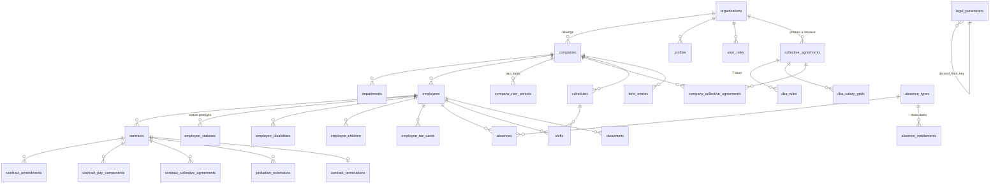

# Modèle de données

Ce document décrit les tables de LuxRH, par domaine, avec leurs relations et leurs clés
d'isolation. Il s'adresse aux développeurs qui écrivent des requêtes ou des migrations.

**État vérifié le 10 septembre 2026.** La base déployée porte **75 tables** (vérifié par requête
sur `pg_class`/`pg_namespace`, schéma `public`, hors extension). Les migrations 46 à 56 sont
**appliquées** ; elles ont ajouté six tables au fil de la série — `data_access_log` (migration 49),
`expected_parameters` (migration 50), `client_sites` et `travel_distances` (migration 52),
`address_zones` et `address_checks` (migration 56) — aux 47 qui existaient depuis la migration 39.
La migration 55 n'ajoute aucune table : elle pose une contrainte, une fonction et des index sur des
tables existantes (§ Domaine 5 et § Types énumérés plus bas).

Le schéma de référence est PostgreSQL. Il est extrait dans `schema/catalogue.json` — 47 tables et
20 types énumérés à la date de sa dernière régénération, donc **antérieur aux migrations 47 à 56**
et à recalculer pour refléter les 53 tables actuelles — d'où `tools/emit_portable_schema.py` dérive
les schémas Oracle et MySQL. Voir [bases-de-donnees.md](bases-de-donnees.md).

---

## Les deux clés d'isolation

Toute l'architecture de sécurité repose sur deux colonnes.

| Colonne | Portée | Vérifiée par |
|---|---|---|
| `organization_id` | L'**espace de travail** : une fiduciaire, ou une entreprise unique | `auth_org_id()` |
| `company_id` | Le **dossier** : une société cliente à l'intérieur de cet espace | `has_company_access()`, `can_manage_company()` |

Les tables portant des données de salarié dénormalisent volontairement `company_id` **en plus** de
`employee_id`. Ce n'est pas une redondance accidentelle : elle permet à une politique RLS de trancher
sans jointure, ce qui compte pour les performances autant que pour la lisibilité de la politique.

**Migration 48 — l'isolation devient aussi structurelle.** Jusqu'ici, rien n'empêchait *au niveau
du schéma* qu'un contrat désigne une société et un salarié d'une autre société : RLS interdisait de
le lire, mais la ligne pouvait exister. La migration pose des clés étrangères composites —
`employees (id, company_id)` unique, puis `foreign key (employee_id, company_id) references
employees (id, company_id)` sur `contracts`, `absences`, `time_entries`, `shifts`,
`employee_children`, `employee_disabilities`, `employee_statuses`, `premiums`,
`meal_voucher_grants`, `overtime_requests` — qui rendent la paire incohérente impossible à écrire,
avec `on update cascade` pour un salarié déplacé d'une société à l'autre. Elle ajoute aussi une
série de contraintes `check` **structurelles seulement** — une fin qui ne précède pas un début, une
part qui ne dépasse pas son tout — en prenant soin de n'y inscrire **aucun seuil légal** : ceux-ci
restent dans `legal_parameters`, conformément à la règle 1 du CLAUDE.md. Un seul candidat de
contrainte a été écarté à la revue : « un contrat actif porte une date de signature », que 305
lignes du jeu de démonstration violent déjà — voir le commentaire de fin de la migration 48. La
migration 48 avait porté la base à **70 contraintes `check`** et **12 clés étrangères composites**
sur le schéma `public` ; la migration 56 en ajoute trois de plus sur `address_zones` et
`address_checks` (§ Domaine 10) — **73 contraintes `check`** aujourd'hui, vérifié sur la base
déployée.

Migration 47, appliquée séparément, commente le schéma : les **51 tables** vivantes à cette date et
**242 colonnes** portent un commentaire SQL (`comment on table` / `comment on column`), visible dans
tout client qui interroge `pg_description`. Les deux tables ajoutées ensuite par la migration 56,
`address_zones` et `address_checks`, portent elles aussi leur commentaire, posé dans leur propre
migration plutôt que reporté sur la 47.

**Migration 53 — une régression attrapée par les tests, corrigée dans la foulée.** Les clés
composites de la migration 48 coexistaient avec les clés simples `(employee_id)` déjà en place :
PostgREST y voyait **deux relations distinctes** entre les mêmes tables, et une requête imbriquée
du type `employees?select=*,contracts(...)` échouait en `PGRST201` (relation ambiguë). La clé
composite subsumant strictement la simple, la migration 53 retire les onze clés simples devenues
redondantes. Aucune intégrité perdue — c'est un rappel qu'**une clé étrangère est aussi une arête du
graphe de relations que PostgREST expose** : en ajouter une change le contrat d'API, même sans
toucher une ligne de front.

Les 75 tables déployées ont RLS active — vérifié sur la base déployée, aucune exception. 184
politiques y sont installées (52 `select`, 44 `insert`, 45 `update`, 43 `delete`). `app_secrets`
est le seul cas où RLS est active **sans aucune politique** : la table est donc inaccessible depuis
l'API, et sa clé n'est lue que par une fonction `security definer`. Les quatre tables ajoutées par
les migrations 49, 50 et 52 portent RLS dès leur création — `expected_parameters` en lecture seule
pour tout authentifié, `client_sites` avec les quatre politiques habituelles, `data_access_log` et
`travel_distances` en **lecture seule** : aucune politique d'écriture n'y est créée pour un rôle
applicatif, seules des fonctions `security definer` y insèrent. Les deux tables de la migration 56,
`address_zones` et `address_checks`, suivent le même principe : chacune ne porte qu'**une politique
de lecture**, aucune politique d'écriture pour un rôle applicatif — seules `fn_check_address` et les
lignes semées par la migration y insèrent, `security definer` oblige.

---

## Vue d'ensemble des relations principales

Le référentiel (`legal_parameters`, `public_holidays`, `tax_brackets`, `tax_credits`,
`document_types`, `benefit_types`, `absence_types`) est volontairement **hors de ce graphe** : il
n'appartient à personne. Il est lisible par tout utilisateur connecté, et modifiable par les seuls
administrateurs d'espace.

---

## Domaine 1 — Socle et identité

| Table | Isolation | Ce qu'elle porte |
|---|---|---|
| `organizations` | racine | L'espace de travail : nom, type (`fiduciary` / `company`) |
| `profiles` | `organization_id` | Le profil applicatif, adossé à `auth.users` |
| `user_roles` | `organization_id`, `company_id` | Quatre rôles (`app_role`) : administrateur, gestionnaire, manager de service, salarié. `company_id` nul = sur tout l'espace |
| `companies` | `organization_id` | Le dossier : raison sociale, forme juridique, RCS, matricule CCSS, adresse, NACE |
| `departments` | `company_id` | Les services |
| `audit_log` | `company_id` | Journal **en insertion seule** sur contrats, temps de travail et absences. La migration 49 y ajoute `source_ip`/`user_agent`/`request_id` et étend les déclencheurs à `employees`, `documents`, `employee_tax_cards`, `meal_voucher_grants` |
| `data_access_log` | `company_id`, `subject_employee_id` (l'un ou l'autre nullable) | **Migration 49.** Journal des **lectures** de données personnelles — consultation, déchiffrement, export, téléchargement — complémentaire d'`audit_log`, qui ne voit que les écritures. Colonne `is_autonomous` (migration 51) : vrai si la trace a été écrite hors de la transaction appelante, via `dblink`. Contient déjà deux lignes `DECRYPT`, écrites pendant l'exécution de la suite de tests elle-même, toutes deux `is_autonomous = false` faute de `dblink_conninfo` chargée |
| `app_secrets` | — | La clé de chiffrement. RLS active, **aucune politique** — c'est voulu : la table est inaccessible depuis l'API. Porte aussi la clé `dblink_conninfo` nécessaire à la trace autonome (migration 51) — absente tant que personne ne l'a chargée |

Une inscription déclenche `handle_new_user` (déclencheur, non exposé), qui crée l'organisation et le
profil à partir des métadonnées du compte.

## Domaine 2 — Référentiel légal

| Table | Ce qu'elle porte |
|---|---|
| `legal_parameters` | **Le cœur.** Une ligne par version datée : valeur, unité, `valid_from`/`valid_to`, `source`, `legal_ref`, dérivation, saisie et double lecture. Contrainte d'exclusion GiST sur `(param_key, daterange)` |
| `public_holidays` | Jours fériés générés par algorithme, jamais saisis. `collective_agreement_id` non nul = férié d'usage propre à une CCT |
| `tax_brackets` | Barème de retenue d'impôt, par classe et par période. **Vide aujourd'hui** |
| `tax_credits` | Crédits d'impôt — 5 lignes chargées |
| `benefit_types` | Neuf types d'avantages en nature et leur méthode de valorisation |
| `document_types` | Type de document, étape (`document_stage`), durée de validité, obligation de remise |
| `absence_types` | Le catalogue des absences — dix-sept types |
| `absence_entitlements` | Le **droit daté** attaché à un type : mariage 6 jours avant 2018, 3 jours après |
| `expected_parameters` | **Migration 50.** Clé primaire `param_key` : la liste des clés que le moteur lit réellement, relevées dans le code des migrations, avec la ou les fonctions qui les lisent (`read_by`). Ne porte **aucune valeur légale** — sert de base à `fn_referential_gaps` pour signaler une clé jamais chargée. 76 clés y sont déclarées, dont `mileage_allowance_eur_per_km` et `accident_class_rates`, déclarées et **toujours vides** : aucune valeur légale n'a été inventée pour les combler |

`tax_scales`, créée par la migration 02, a été **supprimée** par la migration 37 et remplacée par
`tax_brackets`. En comptant les quatre tables ajoutées par les migrations 49, 50 et 52 puis les deux
ajoutées par la migration 56, **54 tables ont été créées au total sur l'ensemble de la série de
migrations, 53 vivent aujourd'hui** sur la base déployée.

## Domaine 3 — Conventions collectives

| Table | Isolation | Ce qu'elle porte |
|---|---|---|
| `collective_agreements` | `organization_id` **nullable** | La CCT. `organization_id` nul = convention partagée, en lecture seule pour tous les espaces (HORECA, aides et soins, gardiennage, US9) |
| `cba_rules` | via la CCT | Les sept blocs (`cba_block`), chacun avec son JSON de règles et son drapeau `is_complete` |
| `cba_salary_grids` | via la CCT | Les grilles de salaire |
| `company_collective_agreements` | `company_id` | Rattachement société ↔ CCT, avec période et portée (`cba_scope`) |
| `contract_collective_agreements` | via le contrat | Rattachement contrat ↔ CCT, même principe |

Le fait que `organization_id` soit **nullable** est un point à connaître : une requête d'export qui
filtrerait sur la seule organisation du demandeur ferait disparaître les CCT sectorielles. La suite
`portability` le vérifie explicitement.

## Domaine 4 — Salariés

| Table | Isolation | Ce qu'elle porte |
|---|---|---|
| `employees` | `company_id` | Identité, qualification, résidence, et les colonnes **chiffrées** du matricule national et de l'IBAN |
| `employee_tax_cards` | `employee_id`, `company_id` | Fiche de retenue d'impôt |
| `employee_statuses` | `employee_id`, `company_id` | Statuts protégés (`employee_status_kind`) : grossesse, allaitement, mandat de délégué, prime de réemploi, gérance |
| `employee_disabilities` | `employee_id`, `company_id` | Taux de handicap reconnu, autorité, **par période sans chevauchement** |
| `employee_children` | `employee_id`, `company_id` | Enfants. Le refus des attentions (`privacy_opt_out`) déclenche `fn_child_privacy`, qui **efface** nom et sexe en base : seule la date de naissance subsiste, pour établir les droits à congé |
| `documents` | `employee_id`, `company_id` | Métadonnées et chemin de stockage. Contrainte d'unicité sur l'emplacement, pour permettre l'upsert lors d'une régénération |

**Migration 55 — recherche par nom.** `employees.last_name` et `employees.first_name` portent
chacun deux index : un index fonctionnel sur `upper(...)` (égalité et préfixe), et un index
trigramme GIN (`pg_trgm`) qui sert la recherche **infixe** `ilike '%…%'` que `fn_employee_rows`
effectue réellement. `companies.legal_name` et `client_sites.name` ne portent, eux, que l'index
fonctionnel — aucun écran n'y fait de recherche infixe aujourd'hui. Voir
[architecture.md](architecture.md) pour l'explication de ce choix, posé comme cas d'école.

## Domaine 5 — Contrats

| Table | Isolation | Ce qu'elle porte |
|---|---|---|
| `contracts` | `company_id`, `employee_id` | 37 colonnes : type (`contract_kind` — CDI, CDD, saisonnier, apprentissage, intérim), statut, poste, dates, essai, heures, salaire, motif et bornes du CDD. **Migration 55** : contrainte d'exclusion GiST `one_active_contract_at_a_time` — un salarié n'a qu'un seul contrat au statut `active` dont la période recouvre celle d'un autre. Voir [moteur-de-regles.md](moteur-de-regles.md) |
| `contract_amendments` | `contract_id` | Avenants, journalisés par `fn_amend_contract` (migration 55) : motif, ce qui a changé (`changes`), qui a signé |
| `contract_pay_components` | `contract_id` | Rémunération à partie variable (`pay_component_kind`). Reportée automatiquement sur le contrat suivant par un avenant |
| `probation_extensions` | `contract_id` | Prolongations d'essai par incapacité |
| `contract_terminations` | `contract_id` | Rupture : motif, dates, indemnités |
| `interim_agencies` | `organization_id` | Agences d'intérim |

**Migration 55 — le cycle de vie du contrat devient une règle de schéma.** Jusqu'ici, rien
n'empêchait qu'un salarié se voie attribuer deux contrats `active` en même temps : seule la
discipline de saisie l'évitait. La contrainte d'exclusion interdit désormais qu'un `daterange`
`(start_date, end_date, '[]')` recouvre celui d'un autre contrat actif du même salarié — vérifié
avant pose sur les 319 contrats actifs de la base (zéro chevauchement), vérifié après pose par une
insertion volontairement en conflit, rejetée. `fn_amend_contract(p_contract, p_effective_date,
p_changes, p_reason)` est la seule voie de modification d'un contrat en cours : elle clôt l'ancien
la veille de la prise d'effet, reconstruit le nouveau depuis `to_jsonb(ancien)` — pour qu'une
colonne ajoutée plus tard soit reportée sans énumération manuelle —, reporte les lignes de
`contract_pay_components` et `contract_collective_agreements` encore en vigueur, et journalise dans
`contract_amendments`. Le contrat qui en résulte part **non signé**. Détail dans
[api-serveur.md](api-serveur.md) et [moteur-de-regles.md](moteur-de-regles.md).

## Domaine 6 — Temps de travail

| Table | Isolation | Ce qu'elle porte |
|---|---|---|
| `schedules` | `company_id` | Le planning d'une semaine, avec son statut (`schedule_status` : `draft` / `published`) |
| `shifts` | `schedule_id`, `company_id`, `employee_id` | Les services |
| `shift_templates` | `company_id` | Modèles réutilisables |
| `time_entries` | `company_id`, `employee_id` | Le registre du temps réellement travaillé |
| `reference_periods` | `company_id` | La période de référence pour la moyenne hebdomadaire |
| `overtime_requests` | `company_id`, `employee_id`, `schedule_id` | Demande d'heures supplémentaires, avec son statut : `requested` → `hr_approved` → `approved` |
| `client_sites` | `company_id` | **Migration 52.** Lieu d'intervention hors siège (chantier, site client, antenne) : adresse ou coordonnées, exigées à la saisie. `shifts.client_site_id` (nul = au siège) y renvoie par clé composite `(id, company_id)` |
| `travel_distances` | via `origin_ref`/`destination_ref` (`employee:<uuid>`, `company:<uuid>`, `site:<uuid>`) | **Migration 52.** Cache de distances routières : une adresse n'est transmise au service externe qu'au premier calcul d'un couple. Porte sa `source` et sa date de calcul, jamais l'adresse elle-même |

Un salarié ne voit ses `shifts` **que si le planning est publié**. C'est une politique RLS, pas un
filtre d'interface : `tests/rls.test.mjs` et `tests/publication.test.mjs` le vérifient tous deux.

## Domaine 7 — Absences

| Table | Isolation | Ce qu'elle porte |
|---|---|---|
| `absences` | `company_id`, `employee_id` | Demandes et incapacités : type, dates, jours décomptés, statut (`absence_status`), certificat |
| `compliance_alerts` | `company_id`, `employee_id` | Alertes persistées, avec leur gravité (`severity_kind`) et leur état (`alert_state`) |

## Domaine 8 — Rémunération et charges société

| Table | Isolation | Ce qu'elle porte |
|---|---|---|
| `company_rate_periods` | `company_id` | Classe d'activité, classe Mutualité, facteur accident, **par période sans chevauchement** |
| `company_financials` | `company_id` | Bénéfice par exercice — base de l'enveloppe de primes participatives |
| `company_accident_claims` | `company_id` | Sinistralité |
| `premiums` | `company_id`, `employee_id`, `contract_id` | Primes : nature, montant, traitement fiscal, exercice |
| `meal_voucher_grants` | `company_id`, `employee_id` | Chèques-repas : nombre, valeur faciale, participation du salarié |

## Domaine 9 — Effectifs et portabilité

| Table | Isolation | Ce qu'elle porte |
|---|---|---|
| `headcount_snapshots` | `company_id` | Photographies d'effectif, pour la moyenne sur 12 mois |
| `export_log` | `organization_id` | Registre des demandes d'export : genre du sujet, nombre d'objets, taille |

## Domaine 10 — Adresses et zones autorisées

**Migration 56.** Deux tables, hors du graphe de relations principal comme le reste du référentiel :
elles n'appartiennent à aucune société en particulier, mais qualifient les adresses saisies sur
`employees`, `companies` et `client_sites`.

| Table | Isolation | Ce qu'elle porte |
|---|---|---|
| `address_zones` | — (lecture ouverte à tout authentifié) | Les zones où une adresse est acceptée : Luxembourg entier ; provinces de Liège, Namur, Luxembourg (BE) ; départements 54 et 57 (FR) ; Rhénanie-Palatinat et Sarre (DE). **8 lignes** sur la base déployée. Chaque zone porte sa `source`. Les deux zones allemandes ont `postal_from`/`postal_to` **nuls** et `is_verified = false` — une contrainte (`address_zone_verified_needs_range`) interdit de se déclarer vérifié sans bornes |
| `address_checks` | `company_id` (nullable) | Le **dernier verdict** de validation par objet (`entity_table`, `entity_id`), unique par paire. Une adresse `unknown` y reste visible — ce n'est pas un refus, c'est un signalement à reprendre |

`fn_validate_address(country, postal, city)` répond `ok`, `outside` ou `unknown` — jamais un
booléen : « on ne sait pas » n'est pas « non ». Le déclencheur `check_address`, posé sur les trois
tables citées plus haut, n'appelle cette fonction **que si l'adresse a changé** (comparaison à
`old`), et **refuse l'écriture** sur un verdict `outside`. Un verdict `unknown` est accepté et
enregistré : le moteur ne bloque que ce qu'il sait situer hors zone, jamais ce qu'il ignore. Détail
des fonctions dans [api-serveur.md](api-serveur.md), principe dans
[moteur-de-regles.md](moteur-de-regles.md).

Pourquoi les bornes allemandes sont vides plutôt qu'approximatives : les codes postaux allemands ne
se rattachent pas proprement à un Land — la Rhénanie-Palatinat partage des préfixes avec la Hesse,
la Sarre et le Bade-Wurtemberg. Écrire un intervalle plausible aurait accepté ou refusé des adresses
à tort. La règle 7 du CLAUDE.md — pas de valeur légale ou administrative inventée — s'applique donc
aussi à un intervalle postal.

---

## Types énumérés

20 types au total. Les principaux :

| Type | Valeurs |
|---|---|
| `app_role` | administrateur, gestionnaire, manager de service, salarié |
| `org_kind` | `fiduciary`, `company` |
| `contract_kind` | `cdi`, `cdd`, `seasonal`, `apprenticeship`, `interim` |
| `contract_status` · `schedule_status` · `absence_status` | cycles de vie |
| `param_family` | `social`, `ccss`, `fiscal`, `worktime`, `leave`, `contract`, `headcount` |
| `cba_block` | `salary_grid`, `worktime`, `leave`, `premiums`, `surcharges`, `notice_probation`, `custom_holidays` |
| `cba_scope` | `sector`, `harassment`, `employee_category`, `department`, `company` |
| `severity_kind` | `blocking`, `warning`, `info`, `ok` |
| `sex_kind` | `male`, `female`, `unspecified` |
| `qualification_kind` · `residency_kind` · `tax_class` · `tax_periodicity` · `absence_category` · `employee_status_kind` · `document_stage` · `pay_component_kind` · `alert_state` | — |

Ajouter une valeur à un type énuméré **doit se faire dans sa propre migration** : PostgreSQL
interdit d'utiliser une valeur d'enum dans la transaction qui l'ajoute. Les migrations 20 et 28
existent uniquement pour cela.

---

## Ce que la traduction vers Oracle et MySQL ne porte pas

Les fichiers `schema/oracle.sql` et `schema/mysql.sql` listent en clair, à la fin, **43 points**
non traduits : contraintes `CHECK` reposant sur des expressions PostgreSQL, références à
`auth.users` propres à Supabase Auth, et surtout les **contraintes d'exclusion** — remplacées par
un déclencheur généré table par table. Le détail est dans [bases-de-donnees.md](bases-de-donnees.md).

---

## Voir aussi

- [index.md](index.md) — sommaire de la documentation
- [architecture.md](architecture.md) — la place de la base dans l'ensemble
- [moteur-de-regles.md](moteur-de-regles.md) — comment `legal_parameters` est lu
- [api-serveur.md](api-serveur.md) — les fonctions qui lisent ces tables
- [bases-de-donnees.md](bases-de-donnees.md) — le même schéma sur Oracle et MySQL
- [couverture-droit-du-travail.md](couverture-droit-du-travail.md) — les notions qu'aucune table ne représente
